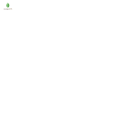

# <b> 👋 Hi! I am Nicolas Maso, enthusiast about programming</b>
 

  <a href="https://github.com/NicolasMaso">
  
  

 

 
  
  
  

  ## <b>👨‍💻 About me</b> 
I'm a full stack developer, currently completing my bachelor's degree in Computer Information Systems. I've been in contact with programming since 2018 and every day I enjoy working with it even more because of the incredible things that can be built and the challenges they provide us with.

Currently specializing in MERN stack.

I always try to code in a clean and organized way.

<b>

  _Never stop learning! 🚀_

</b>
  

## <b>🏫 Education</b>
<table>
  <thead>
    <tr>
      <th>Organization</th>
      <th>Description</th>
      <th>See more</th>
    </tr>
  </thead>

  <tbody>
    <tr>
      <td>

      </td>
      <td>
        <b>[Alura](https://www.alura.com.br/)</b> 
        Complete platform for continuous learning in programming.
      </td>
      <td>
        <b>[Alura](https://www.alura.com.br/)</b> 
      </td>
    </tr>
    <tr>
      <td>

      </td>
      <td>
        <b>[Degree](https://ufsc.br/)</b> 
        Federal University of Santa Catarina - Bachelor of Information Systems
      </td>
      <td>
        <b>[UFSC](https://ufsc.br/)</b> 
      </td>
    </tr>
  </tbody>
</table>
   
  
  
  ## <b>💻 Knowledge / Languages ​​and Tools</b>:

 

   &nbsp;
   &nbsp;
   &nbsp;
   &nbsp;
   &nbsp;
   &nbsp;
   &nbsp;
   &nbsp;
   &nbsp;
   &nbsp;
   &nbsp;
   &nbsp;
   &nbsp;
   &nbsp;
  

   

## <b>✍️ I am studying:</b>

 

  
 &nbsp;
 &nbsp;
 &nbsp;
 &nbsp;
 &nbsp;
  

   

## <b>🤔 I have interest: </b>

 

 &nbsp;
 &nbsp;
 &nbsp;
 &nbsp;
 &nbsp;
 &nbsp;

   

## <b>📞 Contact me</b>

   &nbsp;
   &nbsp;

   

